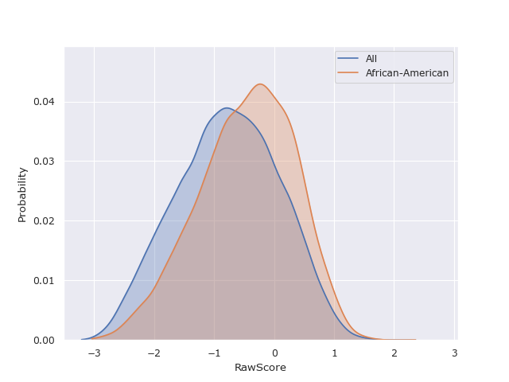

Overview
========

Literature Review
-----------------

In most supervised learning problems, a model is trained on a set of features :math:`X`, to predict or estimate
a target variable :math:`Y`. The resulting prediction of a trained model is denoted by :math:`R`. Additionally, we
define :math:`A`, a subset of :math:`X`, which corresponds to legally protected attributes.

.. math::

  \underbrace{\text{Title}\quad \overbrace{\text{Gender}\quad \text{Ethnicity}}^{A}\quad \text{Legal Status}}_{X}\quad \overbrace{\text{Raw Score}}^{Y}\quad \overbrace{\text{Predicted Score}}^{R}

There are multiple definitions of fairness in literature, and while many can be contentious, results are often
considered fair if they are independent of legally protected characteristics such as age, gender, ethnicity, etc. [1]_

.. math::

  P(R \mid A) = P(R)

In practice, most legally protected attributes tend to be categorical, therefore for the sake of simplicity
we model protected or sensitive variables as discrete random variables, which gives us the following for independence.

.. math::

  P(R \mid A = a) = P(R)\quad \forall a \in A

.. math::
  \text{or}

.. math::

  P(R \mid A = a) = P(R \mid A = b)\quad \forall a,b \in A

While Barocas, Hardt et. al propose 2 alternative fairness or non-discrimination criteria, separation and sufficiency,
which are applicable to a range of problems, we have chosen to work with independence because of its generality [2]_.
Working with this abstract definition of fairness, we quantify the bias of a variable :math:`T` in a group :math:`a`,
as the statistical distance between the the probability distributions of :math:`P(T \mid A = a)` and :math:`P(T)`.

References
----------

.. [1] Solon Barocas, Moritz Hardt, Arvind Narayanan. Fairness and Machine Learning. fairmlbook.org; 2019.

.. [2] Gouic TL, Loubes JM, Rigollet P. Projection to fairness in statistical learning. arXiv preprint arXiv:2005.11720. 2020 May 24.
